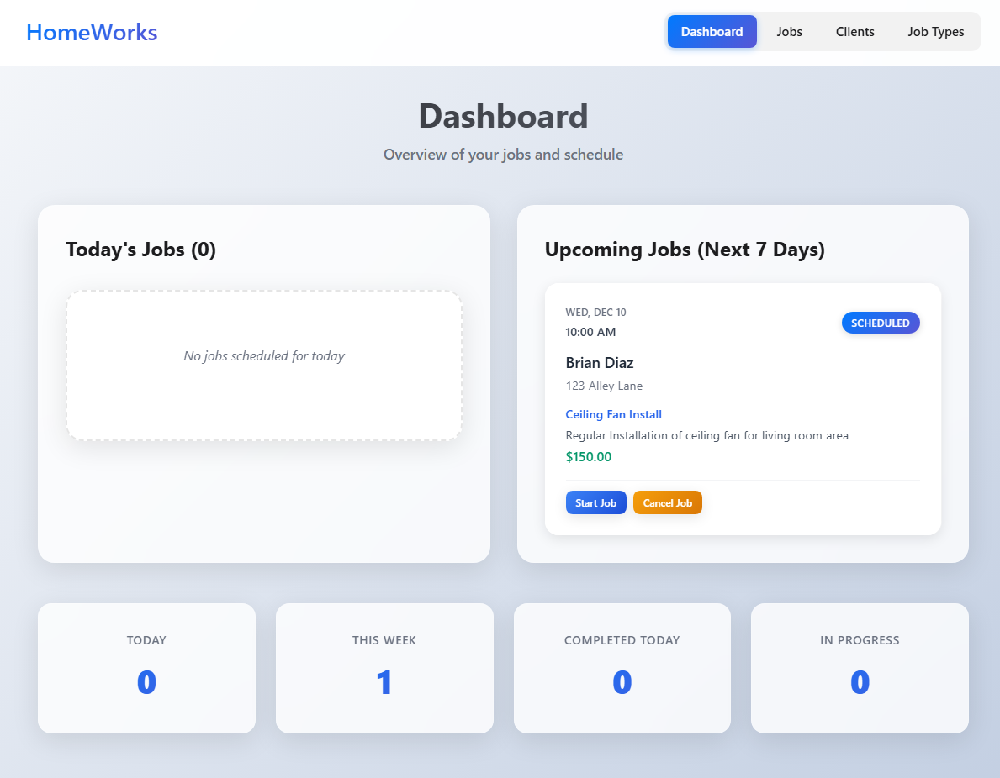
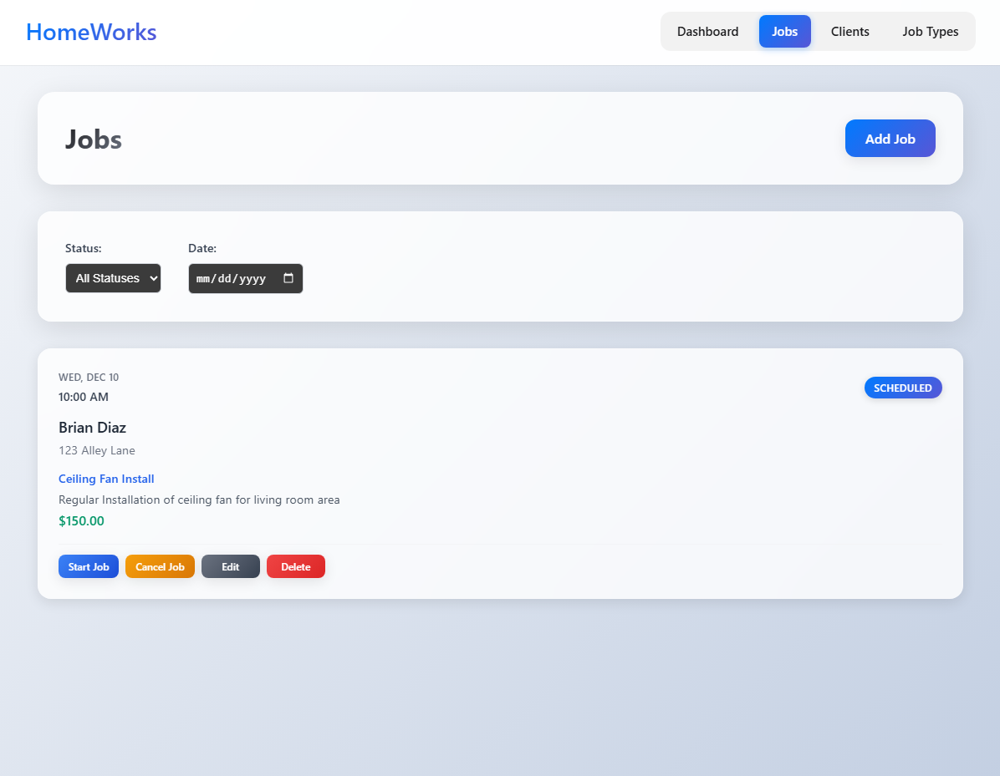
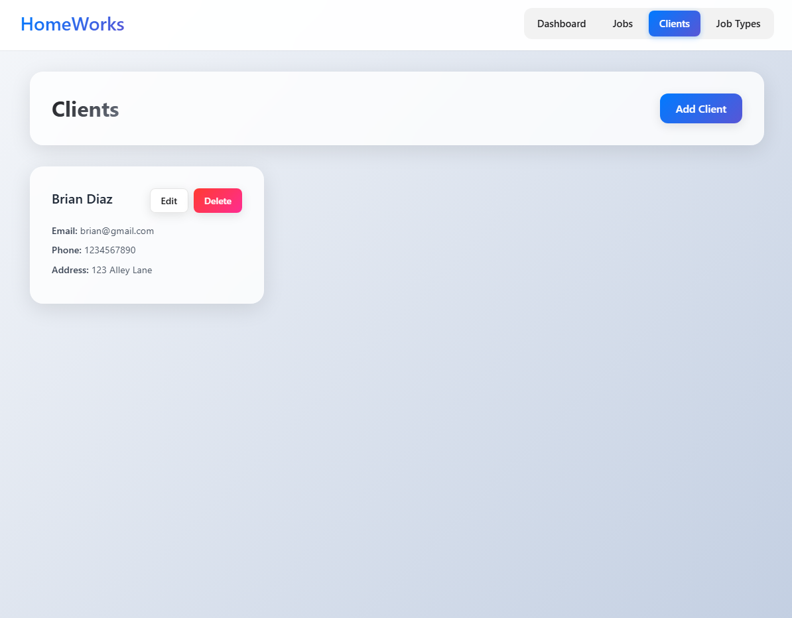
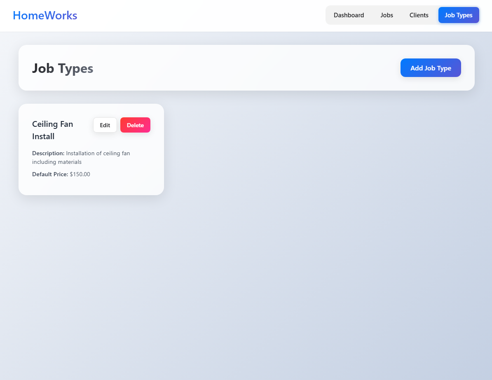

# HomeWorks 🏠⚡

<p align="center">
  <strong>A modern, Apple-inspired home services management platform for freelancers and small service businesses.</strong>
</p>

<p align="center">
  
  
  
  
</p>

HomeWorks transforms the way service professionals manage their business with a sleek, intuitive interface featuring glass morphism design, gradient buttons, and seamless job tracking. Built with modern web technologies and Apple-inspired UX principles.

## ✨ Features

* **🏢 Client Management** - Organize customer information with elegant forms and validation
* **📅 Smart Job Scheduling** - Visual job cards with status tracking and time management  
* **🎨 Apple-Inspired Design** - Glass morphism effects, gradient buttons, and backdrop blur
* **⚡ Real-time Updates** - Live job status changes with smooth animations
* **📱 Responsive Layout** - Beautiful interface that works on all devices
* **🔧 Job Type Templates** - Reusable service templates with default pricing

<p align="center">
  
</p>

## 🚀 Quick Start

### Prerequisites
- Node.js 18+ 
- MySQL 8+
- npm or yarn

### Backend Setup

```bash
cd backend
npm install
npm run start:dev
```

Create your `.env` file:
```env
DB_HOST=localhost
DB_PORT=3306
DB_USER=root
DB_PASS=yourpassword
DB_NAME=homeworks
JWT_SECRET=your-secret-key
```

### Frontend Setup

```bash
cd frontend
npm install
npm run start:dev
```

The app will be available at `http://localhost:5173`

## 🏗️ Architecture

```
homeworks/
├── 📁 backend/           # NestJS API Server
│   ├── 📁 src/
│   │   ├── 📁 modules/   # Feature modules
│   │   ├── 📁 entities/  # Database models
│   │   └── 📁 dtos/      # Data transfer objects
├── 📁 frontend/          # React Client
│   ├── 📁 src/
│   │   ├── 📁 components/ # Reusable UI components
│   │   ├── 📁 pages/     # Route components
│   │   └── 📁 api/       # API client layer
└── 📁 docs/             # Documentation & images
```

## 🎨 Design System

HomeWorks features a comprehensive Apple-inspired design system:

- **Glass Morphism**: Translucent cards with backdrop blur effects
- **Gradient Buttons**: Beautiful color transitions for actions
- **Consistent Spacing**: 8px grid system throughout
- **Typography**: San Francisco-inspired font hierarchy
- **Color Palette**: Blue gradients with semantic color coding

## 🛣️ Roadmap

### ✅ Completed Features
- [x] Modern React + TypeScript frontend
- [x] NestJS backend with TypeORM
- [x] Client management system
- [x] Job scheduling and tracking
- [x] Job type templates
- [x] Apple-inspired UI design
- [x] Responsive layout system
- [x] Form validation and error handling

### 🚧 In Progress
- [ ] Authentication & user management
- [ ] Dashboard analytics
- [ ] Advanced filtering and search

### 🔮 Future Enhancements
- [ ] Mobile app (React Native)
- [ ] Invoicing system integration
- [ ] SMS/Email notifications
- [ ] Calendar sync (Google, Outlook)
- [ ] Photo attachments for jobs
- [ ] Customer portal
- [ ] Reporting dashboard
- [ ] Multi-language support

## 🧪 Tech Stack

| Category | Technology |
|----------|------------|
| **Frontend** | React 18, TypeScript, Vite |
| **Backend** | NestJS, TypeORM, Node.js |
| **Database** | MySQL 8+ |
| **Styling** | CSS3, Glass Morphism, Gradients |
| **State** | React Hooks, Context API |
| **Validation** | Class Validator, React Forms |
| **HTTP Client** | Axios |

## 🤝 Contributing

We welcome contributions! Here's how to get started:

1. **Fork** the repository
2. **Clone** your fork locally
3. **Install** dependencies for both backend and frontend
4. **Create** a feature branch (`git checkout -b feature/amazing-feature`)
5. **Commit** your changes (`git commit -m 'Add amazing feature'`)
6. **Push** to the branch (`git push origin feature/amazing-feature`)
7. **Open** a Pull Request

### Development Guidelines
- Follow TypeScript best practices
- Maintain the Apple-inspired design language
- Write meaningful commit messages
- Add tests for new features
- Update documentation as needed

## 📸 Screenshots

### Job Management
<p align="center">
  
</p>

### Client Management
<p align="center">
  
</p>

### Job Types
<p align="center">
  
</p>

## 📄 License

MIT License - feel free to use this project as a learning resource or starting point for your own service business!

## 🙏 Acknowledgments

- Inspired by Apple's design principles
- Built with love for the service industry community
- Special thanks to all contributors and testers

---

<p align="center">
  <strong>Made with ❤️ for service professionals everywhere</strong>
</p>
